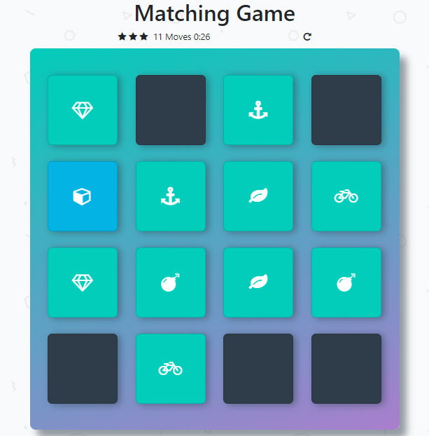

# Memory Game :video_game:

> This game is all about testing your  memory:thought_balloon: and concentration 🧠 .You will have to match cards and accordingly your score will be calculated.Your aim is to match all the cards and :end: the game.

## How To Play

:small_red_triangle_down: Download the game [here](https://github.com/Prateek-Tewari/fend-project-memory-game/archive/master.zip) or play [online](https://prateek-tewari.github.io/fend-project-memory-game/).

If you are downloading the game,then unzip the downloaded version,locate `index.html` and open it with a web browser.
# Voila!!!
Enjoy the game...

### Note:
This project uses Bootstrap 4.0.0 [css](https://maxcdn.bootstrapcdn.com/bootstrap/4.0.0/css/bootstrap.min.css) & [js](https://maxcdn.bootstrapcdn.com/bootstrap/4.0.0/js/bootstrap.min.js),[popper.js](https://cdnjs.cloudflare.com/ajax/libs/popper.js/1.12.9/umd/popper.min.js) and [jQuery](https://code.jquery.com/jquery-3.2.1.slim.min.js) for its winning popup.Please download these if you are playing the game in offline mode.
